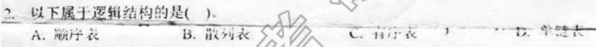
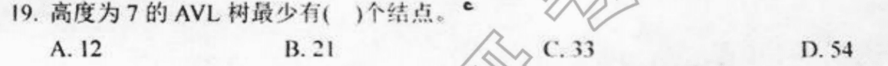
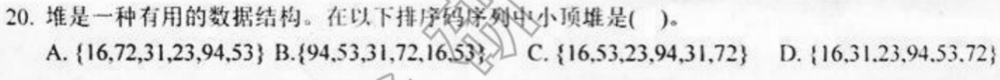
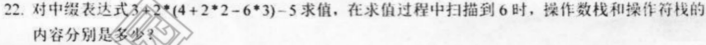
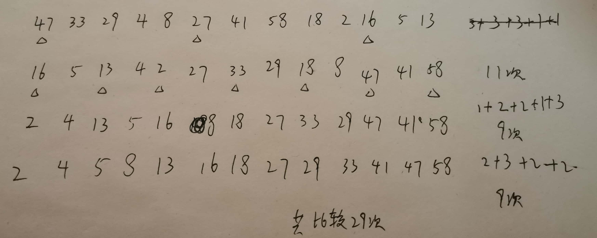
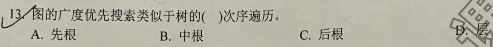
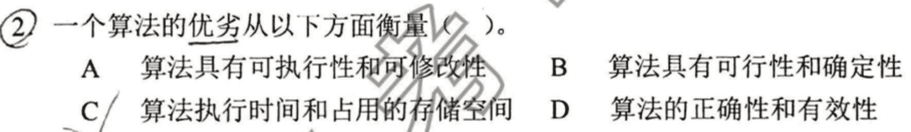
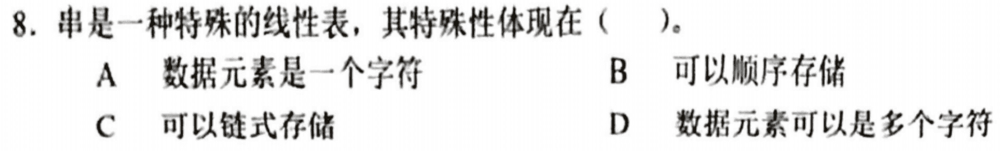
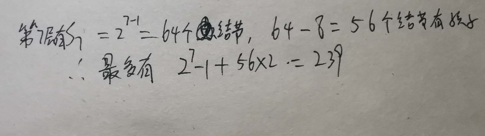
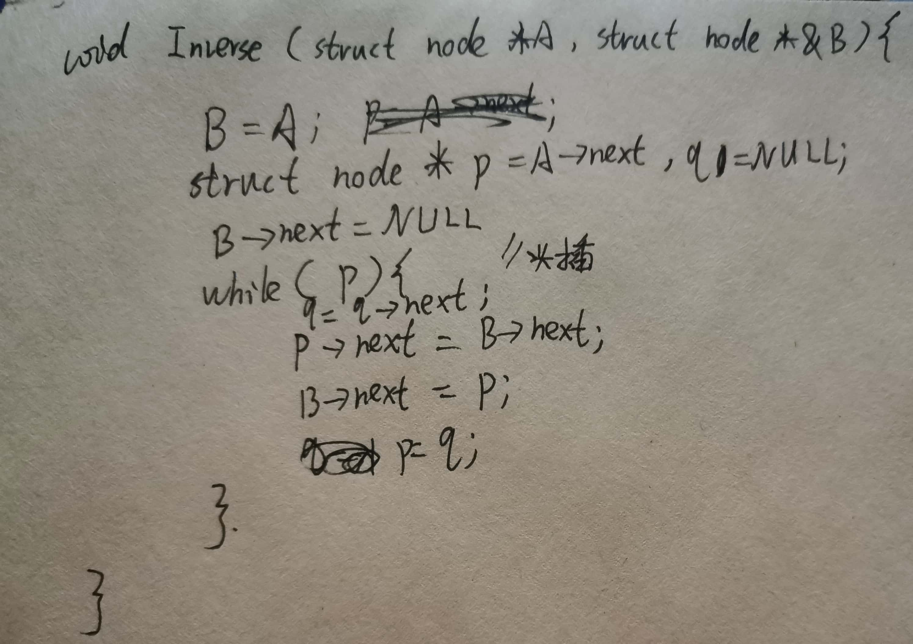

# 2016年硕士研究生入学考试专业课试题

## 选择题

**【答案】C**

**【答案】C**

**【答案】B**

**【答案】C**

**【答案】D**

**【答案】B** $6\times20+2+200$ 

**【答案】A**

**【答案】B** n0=n2+1;n2=123;n_1最多为1

**【答案】C**

**【答案】B**

**【答案】A**

**【答案】A**

**【答案】B**

**【答案】D**

**【答案】D**

**【答案】D**

**【答案】D**

**【答案】C**

**【答案】C**

**【答案】D**

## 简答题

**【答】**

队列不改变出栈之后的循序，所以只需考虑栈，a,b进栈后出b，此时栈最大为2，然后c,d进栈后有元素acd，此时栈最大为3，然后dc出栈，ef进栈，fea出栈，g进栈出栈，所以最大为3

**【答】**

从栈底到栈头为：+，*，（，-和3,2,8

**【答】**

（1） $\cfrac{(1+n)n}{2}$

（2） $\cfrac{(1+j)j}{2}+i$

**【答】**

第一次查找第9个，第二次查找第14个，第三次查找第16个，第四次查找第15个

## 画图题

## 计算题

## 算法设计题

---

# 2017年硕士研究生入学考试专业课试题

## 选择题

**【答案】D**

**【答案】B** (6x20+2)+200

**【答案】B** n0=n2+1;n2=123;n_1最多为1

**【答案】B** 

**【答案】C** 

**【答案】B** 

**【答案】C** f(n)=f(n-1)+f(n-2)+1

**【答案】C** 比46小的排左边，大的排右边

**【答案】C** 

**【答案】D** 堆排序、快速排序、希尔排序、直接选择排序是不稳定的排序算法，而冒泡排序、直接插入排序、折半插入排序、归并排序是稳定的排序算法。

**【答案】A** 

**【答案】B** 

**【答案】B** 

## 简答题

**【答】**

求1到n的阶乘之和，复杂度为O(n^2)

**【答】**

next=[0,1,1,2,2,3,1,2,1,2,3,4,5]

**【答】**

（1） $\cfrac{(1+n)n}{2}$ 

（2） $\cfrac{(2n-i+1)i}{2}+j-i$ 

**【答】**

abcfefg；acbdefg；abcdfeg

## 画图题

**D节点画反了**

## 计算题

## 算法设计题

---

# 2018年硕士研究生入学考试专业课试题

## 选择题

**【答案】C**

**【答案】B**

**【答案】B**

**【答案】D**

**【答案】B**

**【答案】C**

**【答案】D**

**【答案】A**

**【答案】B**

**【答案】A**

**【答案】B**

**【答案】C**

**【答案】D**

**【答案】B**

**【答案】C**

**【答案】C**

**【答案】B**

**【答案】C**

**【答案】C**

**【答案】D**

## 简答题

**【答】**

求1到n的阶乘之和，复杂度为O(n^2)

**【答】**

next=[0,1,1,1,2,2,3,1,2,3,4,5]

**【答】**

（1） $\cfrac{(1+n)n}{2}$ 

（2） $\cfrac{(2n-i+1)i}{2}+j-i$ 

**【答】**

11个元素，首次查找(11+1)/2=6，得到50，第二次(7+11)/2=9，得到90，第三次(7+8)/2=7，得到62，第四次查找(8+8)/2=8，得到83

**【答】**

n=n0+n1+n2+n3+n4；n=n1+2n2+3n3+4n4；n0=n2+2n3+3n4=1+20+60=81

## 计算题

## 应用题

## 算法设计题

# 2019年硕士研究生入学考试专业课试题

## 选择题

**【答案】A**

**【答案】C**

**【答案】B**

**【答案】C**

**【答案】C**

**【答案】C**

**【答案】D**

**【答案】A**

**【答案】C**

**【答案】B**

**【答案】D**

**【答案】A**

**【答案】A**

**【答案】C**

**【答案】D**

**【答案】D**

**【答案】B**

**【答案】D**

**【答案】A**

**【答案】B**

## 简答题

**【答】**

求1到n的阶乘之和，复杂度为O(n^2)

**【答】**

RSTQP,RSQTP,RSQPT

**【答】**

0,1,1,2,2,3,1,2,1,2

**【答】**

5104

10<–>4

35<–>10

10<–>1

1<–>16

结果：4,9,1,10,16,20,25

## 计算题

## 应用题

**【答】**

[“apple”,”pineapple”,”orange”,”lemon”]，顺序查找，0.35+0.7+0.45+0.6=2.1

## 算法设计题

