[数据结构C语言严蔚敏版(第二版)超详细笔记附带课后习题 ](https://blog.csdn.net/chongyang_/article/details/109544719) 

[王道计算机考研 数据结构](https://www.bilibili.com/video/BV1b7411N798) 

[(数据结构（C语言版 第2版）课后习题答案全集 严蔚敏 等 编著](https://blog.csdn.net/weixin_43899069/article/details/112395830)

# 一、绪论

## 基本概念和术语


### 数据、数据结构、数据项和数据对象


### 数据结构三要素

数据结构包括**逻辑结构和存储结构**两个层次。

#### 逻辑结构

**逻辑结构**分为四种类型：**集合结构，线性结构，树形结构，图形结构**。


#### 数据运算


#### 物理结构

**物理结构又叫存储结构**，分为两种，一种是**顺序存储结构**一种是**链式存储结构**。


顺序存储结构是把数据元素放到地址**连续的存储单元**里面，其**数据间的逻辑关系和物理关系**是一致的。之前学习的数组就是一种顺序存储结构。

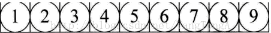

链式存储结构：是把数据元素存放在任意的存储单元里面，这组**存储单元可以是连续的也可以是不连续的**。

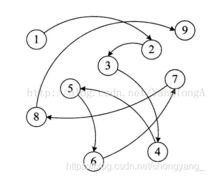


### 数据类型和抽象数据类型

#### 数据类型

一般包括**整型、实型、字符型**等原子类型外，还有**数组、结构体和指针等结构类型**。


#### 抽象数据类型

**抽象数据类型（Abstract Data Type,ADT）**，类似C语言中的结构体以及C++、java语言中的类。

通俗的讲，抽象数据类型，泛指**除基本数据类型以外的数据类型**。

## 算法和算法分析

**算法 + 数据结构 = 程序**

### 算法的定义及特性

**算法**是为了解决某类问题而规定的一个**有限长的操作序列**。

一个算法必须满足以下五个重要特性： **有穷性**、 **确定性** 、 **可行性**、 **输入** 、**输出**


### 评价算法优劣的基本标准

**正确性** 、 **可读性** 、 **健壮性** 、 **高效性与低存储量需求**

### 算法的时间复杂度

详细可以看这个：[一套图搞懂“时间复杂度”](https://blog.csdn.net/qq_41523096/article/details/82142747?ops_request_misc=%7B%22request%5Fid%22%3A%22160471359019724838561636%22%2C%22scm%22%3A%2220140713.130102334..%22%7D&request_id=160471359019724838561636&biz_id=0&utm_medium=distribute.pc_search_result.none-task-blog-2~all~top_click~default-2-82142747.pc_first_rank_v2_rank_v28&utm_term=时间复杂度&spm=1018.2118.3001.4449) 
$$
T(n)=O(f(n))\Leftrightarrow\lim_{n\rightarrow\infty}\frac{T(n)}{f(n)}=k(T(n)为程序语句次数，f(n)为同阶无穷大)
$$


#### 最好、最坏和平均时间复杂度

1. **最好时间复杂度**，指的是算法计算量可能达到的最小值，这个一般不看。
2. **最坏时间复杂度**，指的是算法计算量可能达到的最大值。
3. **平均时间复杂度**，是指算法在所有可能情况下，按照输入实例以等概率出现时，算法计算量的加权平均值。

### 算法的空间复杂度

空间复杂度只需要分析辅助变量所占的额外空间。

空间复杂度：S(n) = O(f(n))

如果算法执行所需要的临时空间不随着某个变量n的大小而变化，即此算法空间复杂度为一个常量，可表示为 O(1)

```c
int i = 1;
int j = 2;
++i;
j++;
int m = i + j;
```

代码中的 i、j、m 所分配的空间都不随着处理数据量变化，因此它的空间复杂度 S(n) = O(1)

```c
int []m = new int[n];
    for (i = 1; i <= n; ++i) {
        j = i;
        j++;
    }
```

这段代码中，第一行new了一个数组出来，这个数据占用的大小为n，这段代码的2-5行，虽然有循环，但没有再分配新的空间，因此，这段代码的空间复杂度主要看第一行即可，即 S(n) = O(n)

# 二、线性表

## 线性表的类型定义


## 线性表的顺序表示和实现

### 线性表的顺序表示

**线性表的顺序存储又被称为顺序表**

顺序存储表示：用一组地址连续的存储单元依次存储线性表的数据元素的方式，具有顺序存储结构的特点（**数据间的逻辑关系和物理关系是一致的**）

假设线性表 L 存储的起始位置为 LOC(A) ， `sizeof(ElemType)` 是每个数据元素所占用存储空间的大小，则表 L 所对应的顺序存储如下图：


**注意：线性表中的位序是从 1 开始的，而数组中元素的下标是从 0 开始的**

由于线性表的长度可变，且所需最大存储空间随问题的不同而不同，在C语言中通常使用动态分配的一维数组表示线性表

```c
//－－－－－ 顺序表的存储结构－－－－－
#define MAXSIZE 100             //顺序表可能达到的最大长度
typedef struct {
    ElemType *elem;         //存储空间的基地址
    int length;             //当前长度
} SqList;                   //顺序表的结构类型为SqList
```

### 顺序表中基本操作的实现

一、**顺序表初始化**

1. 为顺序表L动态分配一个预定义大小的数组空间，使elem指向这段空间的基地址。
2. 将表的当前长度设为0。

```c
Status InitList(SqList &L) {
    //构造一个空的顺序表 L
    L.elem = new ElemType[MAXSIZE];//为顺序表分配一个大小为MAXSIZE的数组空间，这是C++语句
    if (!L.elem) exit(OVERFLOW);//存储分配失败退出
    L.length = 0;//空表长度为0
    return OK;
}
```

调用

```c
SqList L;
InitList(L);
```

**二、顺序表取值**

1. 判断指定的位置序号 i 值是否合理 (1≤i≤L.length), 若不合理，则返回ERROR。

2. 若 i 值合理，则将第 i 个数据元素 L.elem[i-1] 赋给参数 e, 通过 e返回第 i 个数据元素的传值。

```c
Status GetElem(SqList L, int i, ElemType &e) {
    if(i < 1 || i > L.length)
        return ERROR;//判断l. 值是否合理，若不合理， 返回 ERROR
    e = L.elem[i - 1];//elem[i-1] 单元存储第 i 个数据元素
    return OK;
}
```

顺序表取值算法的时间复杂度为 ：O(1)

**三、顺序表的按值查找**

1. 从第一个元素起，依次和 e 相比较，若找到与 e 相等的元素 L.elem[i] ，则查找成功，返回该元素的序号 i+1 (数组下标从 0 开始)
2. 若查遍整个顺序表都没有找到，则查找失败， 返回0

```c
int LocateELem(SqList L, ElemType e) {
    //在顺序表1中查找值为e的数据元素， 返回其序号
    for (i = 0; i < L.length; i++) {
        if (L.elem[i]==e){
            return i + 1;           //查找成功， 返回序号 i+1
        }
     }
     return 0;                       //查找失败， 返回 0           
}
```

顺序表按值查找算法的平均时间复杂度为 O(n)

**四、顺序表插入元素**

在第 i 个位置插入一个元素时，需从最后一个元素即第 n 个元素开始，依次向后移动一个位置，直至第 i 个元素。


1. 判断插入位置 i 是否合法(i 值的合法范围是 1≤i≤n+1), 若不合法 则返回 ERROR。
2. 判断顺序表的存储空间是否已满，若满则返回 ERROR。
3. 将第n个至第 i 个位置的元素依次向后移动一个位置，空出第 i 个位置 ( i =n+1 时无需移动）。
4. 将要插入的新元素e放入第i个位置。
5. 表长加1

```c
Status Listinsert(SqList &L, int i, ElemType e) {
    //在顺序表 L 中第 i 个位置之前插入新的元素 e, i值的合法范围是 1...i...L.length+1
    if ((i < 1) || (i > L.length + 1)) {
        return ERROR;                       //i值不合法
    }
    if (L.length == MAXSIZE) {
        return ERROR;                       //当前存储空间已满
    }
    for (j = L.length - 1; j >= i - 1; j--) {
        L.elem[j + 1] = L.elem[j];                     //插入位置及之后的元素后移
    }
    L.elem[i - 1] = e;                                //将新元素e放入第l个位置
    ++L.length;                                       //表长加1
    return OK;
}
```

顺序表插入算法的平均时间复杂度为O(n)

**五、顺序表删除元素**

删除第 i 个元素时需将第 i+ 1 个至第 n 个元素依次向前移动一个位置 (i = n 时无需移动）


1. 判断删除位置 i 是否合法（合法值为 1 ≤ i ≤n), 若不合法则返回 ERROR。
2. 将第 i个至第n个的元素依次向前移动一个位置 (i = n时无需移动）
3. 表长减 1

```c
Status ListDelete(SqList &L, int i) {
        //在顺序表L中删除第J.个元素，J.值的合法范围是 1.;;i.;;L. length
    if ((i < 1) || (i > L.length)) {
        return ERROR;                               //i值不合法
    }
    for (j = i; j <= L.length - 1; j++) {
        L.elem[j - 1]=L.elem[j];                    //被删除元素之后的元素前移
    }
    --L.length;                                     //表长减 1
    return OK;
}
```

顺序表删除算法的平均时间复杂度为O(n)

## 线性表的链式表示和实现

链式存储结构的特点：用一组任意的存储单元存储线性表的数据元素（这组存储单元可以是连续的，也可以是不连续的），存放数据元素的结点至少包括两个域（指针域、数据域），也可以包含若干个指针域和数据域。

### 单链表的定义和表示


关于带头结点的单链表及不带头节点的单链表

- 首元结点：是指链表中存储第一个数据元素的结点。

- 头结点：是在首元素结点之前附设的一个结点，其指针指向首元结点。

- 头指针：是指向链表中第一个结点的指针。若链表设有头结点，则头指针所指结点为线性表的头结点；若链表不设头结点，则头指针所指结点为该线性表的首元结点。

带头结点：


不带头结点：


- 带头结点的单链表为空时：`L->next==NULL`
- 不带头结点的单链表为空时：`L==NULL`

```c
//－－－－－ 单链表的存储结构－－－－－
typedef struct LNode {
    ElemType data;          //结点的数据域
    struct LNode *next;     //结点的指针域
} LNode, *LinkList;         //LinkList 为指向结构体 LNode 的指针类型
```

### 单链表基本操作的实现

**一、单链表的初始化**

1. 生成新结点作为头结点，用头指针L 指向头结点。
2. 头结点的指针域置空。

```c
 Status InitList(LinkList &L) {	 //构造一个空的单链表L
     L = new LNode;        	 //生成新结点作为头结点，用头指针L指向头结点
     L->next = NULL;          //头结点的指针域置空,等价(*L).next = NULL;
     return OK;
 }
```

**二、单链表的取值**

1. 用指针p指向首元结点，用 j 做计数器初值赋为1
2. 从首元结点开始依次顺着链域 next 向下访问，只要指向当前结点的指针 p 不为空(NULL), 并且没有到达序号为 i 的结点，则循环执行以下操作：
	- p指向下一个结点；
	- 计数器 j 相应加 1
3. 退出循环时， 如果指针p为空， 或者计数器 j 大于 i, 说明指定的序号 i 值不合法（i 大于表长n或 i 小于等于0), 取值失败返回ERROR; 否则取值成功， 此时 j=i 时，p所指的结点就是要找的第 i 个结点，用参数 e 保存当前结点的数据域， 返回OK。

```c
Status GetElem(LinkList L, int i, ElemType &e) {
    //在带头结点的单链表L中根据序号l.获取元素的值，用e返回L中第l.个数据元素的值
    p = L->next;
    j = 1;                              //初始化，p指向首元结点，计数器］初值赋为1
    while (p && j < i) {                //顺链域向后扫描，直到p为空或p指向第l.个元素
        p = p->next;                    //p指向下一个结点
        ++j;                            //计数器j相应加1
    }

    if (!p || j > i) return ERROR;      // i值不合法 i>n或i≤0
    e = p->data;                        //取第i个结点的数据域
    return OK;
}
```

单链表取值算法的平均时间复杂度为 O(n)

**三、单链表的按值查找**

1. 用指针p指向首元结点
2. 从首元结点开始依次顺着链域next向下查找， 只要指向当前结点的指针p不为空， 并且p所指结点的数据域不等于给定值e, 则循环执行以下操作： p指向下一个结点 。
3. 返回p。若查找成功，p此时即为结点的地址值，若查找失败，p的值即为NULL

```c
LNode *LocateELem(LinkList L, ElemType e) {
    //在带头结点的单链表L中查找值为e的元素
    p = L->next;//初始化，p指向首元结点
    while (p && p->data != e) {//顺链域向后扫描，直到p为空或p所指结点的数据域等于e	
        p = p->next;//p指向下一个结点
    }
    return p; //查找成功返回值为e的结点地址p, 查找失败p为NULL
}
```

单链表的按值查找算法的平均时间复杂度为 O(n)

**四、单链表的插入**

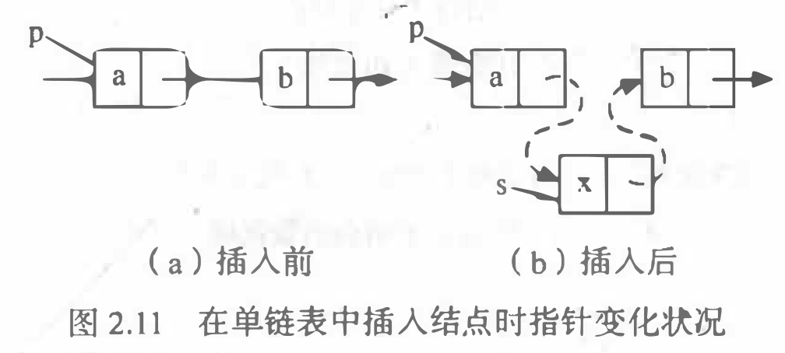

将值为e的新结点插入到表的第 i 个结点的位置上，即插入到结点 ai-1与ai之间。

1. 查找结点 ai-1 并由指针p指向该结点
2. 生成一个新结点 *s
3. 将新结点 *s 的数据域置为 e
4. 将新结点 *s 的指针域指向结点ai

5. 将结点 *p 的指针域指向新结点 *s

```c
Status Listinsert(LinkList &L, int i, ElemType e)
{
    // 在带头结点的单链表L中第i个位置插入值为e的新结点
    p = L;
    j = 0;
    while (p && (j < i - 1))
    {
        p = p->next;
        ++j; // 查找到第i-1个结点，p指向该结点
    }
    if (!p || j > i - 1)
        return ERROR;  // i>n+1 或者 i≤1
    s = new LNode;     // 生成新结点 *s
    s->data = e;       // 将结点*s的数据域置为e
    s->next = p->next; // 将结点 *s的指针域指向结点 ai
    p->next = s;       // 将结点*p的指针域指向结点*s
    return OK;
}
```

**五、单链表的删除**

删除单链表的第 i 个结点ai

1. 查找结点ai-1 并由指针p指向该结点
2. 临时保存待删除结点 ai 的地址在q中 ，以备释放。
3. 将结点*p的指针域指向 ai 的直接后继结点
4. 释放结点ai的空间

```c
Status ListDelete(LinkList &L, int i)
{
    // 在带头结点的单链表L中，删除第l个元素
    p = L;
    j = 0;
    while ((p->next) && (j < i - 1))
    { // 查找第i-1个结点，p指向该结点
        p = p->next;
        ++j;
    }
    if (!(p->next) || (j > i - 1))
        return ERROR;  // 当i＞n或i＜1时，删除位置不合理
    q = p->next;       // 临时保存被删结点的地址以备释放
    p->next = q->next; // 改变删除结点前驱结点的指针域
    delete q;          // 释放删除结点的空间
    return OK;
}
```

单链表删除算法的时间复杂度为： O(n)

**六、创建单链表**

**前插法：**始终让新结点在第一的位置，不常用，因为输入顺序和输出顺序是相反的。


1. 创建一个只有头结点的空链表。

2. 根据待创建链表包括的元素个数n, 循环n次执行以下操作：

	- 生成一个新结点*p

	- 输入元素值赋给新结点*p的数据域；

	- 将新结点*p插入到头结点之后。


**后插法：**尾指针r始终指向单链表的表尾，常用（输入顺序和输出顺序相同）

1. 创建一个只有头结点的空链表。
2. 尾指针r初始化， 指向头结点。
3. 根据创建链表包括的元素个数n, 循环n次执行以下操作：
	- 生成一个新结点 *p;
	- 输入元素值赋给新结点 *p 的数据域；
	- 将新结点 *p 插入到尾结点 *r之后；
	- 尾指针r指向新的尾结点 *p。


### 循环链表


将两个线性表合并成一个表时


### 双向链表


## 顺序表和链表的比较


## 案例分析与实现

线性表的顺序实现案例：[顺序表案例](https://blog.csdn.net/chongyang_/article/details/109557874)
线性表的链式实现案例：[单链表案例](https://blog.csdn.net/chongyang_/article/details/109002378)

# 三、栈和队列

## 栈和队列的定义和特点

### 栈的定义和特点

- 栈：受约束的线性表，只允许栈顶元素入栈和出栈
- 对栈来说，表尾端称为栈顶，表头端称为栈底，不含元素的空表称为空栈
- 先进后出，后进先出


### 队列的定义和特点

- 队列：受约束的线性表，只允许在队尾插入，在队头删除
- 先进先出，后进后出


## 栈的表示和操作的实现

### 栈的类型定义

栈也有两种存储表示方法，分别称为**顺序栈和链栈**。

### 顺序栈的表示和实现

顺序栈的存储结构

```c
//－－－－－ 顺序栈的存储结构－ －－－－
#define MAXSIZE 100 		//顺序栈存储空间的初始分配址
typedef struct{
    SElemType *base; 		//栈底指针
	SElemType *top; 		//栈顶指针
	int stacksize; 			//栈可用的最大容扯
}SqStack;
```

**一、 顺序栈的初始化**


**二、顺序栈的入栈**


**三、顺序栈的出栈**


**四、顺序栈取栈顶元素**


### 链栈的表示和实现


链栈的存储结构：

```c
typedef struct StackNode{
    ElemType data;
    struct StackNode *next;
} StackNode, *LinkStack;
```

**一、链栈的初始化**


**二、链栈的入栈**


**三、链栈的出栈**


**四、链栈取栈顶元素**


### 栈的应用

#### 括号匹配


#### 表达式求值


#### 汉诺塔


## 栈与递归


## 队列的表示和操作的实现

### 循环队列——队列的顺序表示和实现

队列也有两种存储表示，**顺序表示和链表表示**。

单纯的顺序队列有"假溢出"的问题。


为了避免 ”假溢出“，可以将顺序队列变为 一 个环状的空间

- 循环队列解决了“假溢出”(下标溢出)
- 没有解决真溢出（空间溢出）


在这种情况下， 如何区别队满还是队空呢？

1、少用一个元素空间， 即队列空间大小为m时，有m-1个元素就认为是队满。这样判断队空的条件不变， 即当头、 尾指针的值相同时， 则认为队空；而当尾指针在循环意义上加1后是等于头指针， 则认为队满。

队空的条件： Q.front == Q.rear
队满的条件： (Q.rear+ 1)%MAXQSIZE == Q.front
入队：Q.rear = (Q.rear + 1)% MAXQSIZE
出队：Q.front = (Q.front + 1)% MAXQSIZE
当前元素个数： (Q.rear - Q.front + MAXQSIZE) % MAXQSIZE

**一、循环队列的初始化**


**二、循环队列求队列长度**


**三、循环队列入队**


**四、循环队列出队**


**五、循环队列取队头元素**


### 链队——队列的链式表示和实现


**队列的链式存储结构**


**一、链队的初始化**


**二、链队的入队**


**三、链队的出队**

链队在出队前也需要判断队列是否为空，不同的是，链队在出队后需要释放出队头元素的所占空间

①、判断队列是否为空，若空则返回ERROR。

②、临时保存队头元素的空间，以备释放。

③、修改队头指针，指向下一个结点。

④、判断出队元素是否为最后一个元素，若是，则将队尾指针重新赋值， 指向头结点。

⑤、释放原队头元素的空间。


**四、取链队的队头元素**


## 案例分析与实现

[顺序栈的基本操作](https://blog.csdn.net/chongyang_/article/details/109557284)

[链栈的基本操作](https://blog.csdn.net/chongyang_/article/details/109558239)

[循环队列的基本操作](https://blog.csdn.net/chongyang_/article/details/109558404)

[链队的基本操作](https://blog.csdn.net/chongyang_/article/details/109558529)

# 四、串、数组和广义表

串即字符串，是由零个或多个字符组成的有限序列，是数据元素为单个字符的特殊线性表。

1. 串是内容受限的线性表,它限定了表中的元素为字符
2. 串长：串中字符个数（n≥0）. n=0 时称为空串
3. 空白串：由一个或多个空格符组成的串
4. 子串：串S中任意个连续的字符序列叫S的子串; S叫主串

## 串的类型定义、存储结构及其运算

### 串的抽象类型定义

```c
ADT Sting{
    //数据对象
    Objects:    D = {ai | ai∈CharacterSet, i=1, 2, …，n, n≥0}
    //数据关系
    Relations: R1={ <ai - 1, ai > | ai - 1, ai ∈D, i = 2, …，n }
    //基本操作
    functions:                              // 有13种之多
    StrAssign(&T, chars)                    // 串赋值，生成值为chars的串T
        StrCompare(S, T)                        // 串比较，若S>T，返回值大于0…
        StrLength(S)                            // 求串长，即返回S的元素个数
        Concat(&T, S1, S2)                      // 串连接，用T返回S1＋S2的新串
        SubString(&Sub, S, pos, len)            // 求S中pos起长度为len的子串
        ……
        Index(S, T, pos)                        // 返回子串T在pos之后的位置
        Replace(&S, T, V)                       // 用子串V替换子串T
}
ADT Sting
```

### 串的存储结构

#### 串的顺序存储

**定长顺序存储**：用一组连续的存储单元来存放串，直接使用定长的字符数组来定义，数组的上界预先给出，故称为静态存储分配。


例如：C语言约定在串尾加结束符 ‘ \0’，以利操作加速，但不计入串长；

若字符串超过Maxstrlen 则自动截断（因为静态数组存不进去）

想存放超长字符串怎么办？——静态数组有缺陷。 改用动态分配的一维数组堆

**堆分配存储**：仍用一组连续的存储单元来存放串，但存储空间是在程序执行过程中动态按需分配而得


#### 串的链式存储


### 串的模式匹配算法

[串的总结](https://blog.csdn.net/weixin_45625687/article/details/108313796)

[串、数组和广义表知识点](https://blog.csdn.net/weixin_44801852/article/details/106851517)

1. BF算法


2. KMP算法


next数组


就是匹配前后缀最大子串+1


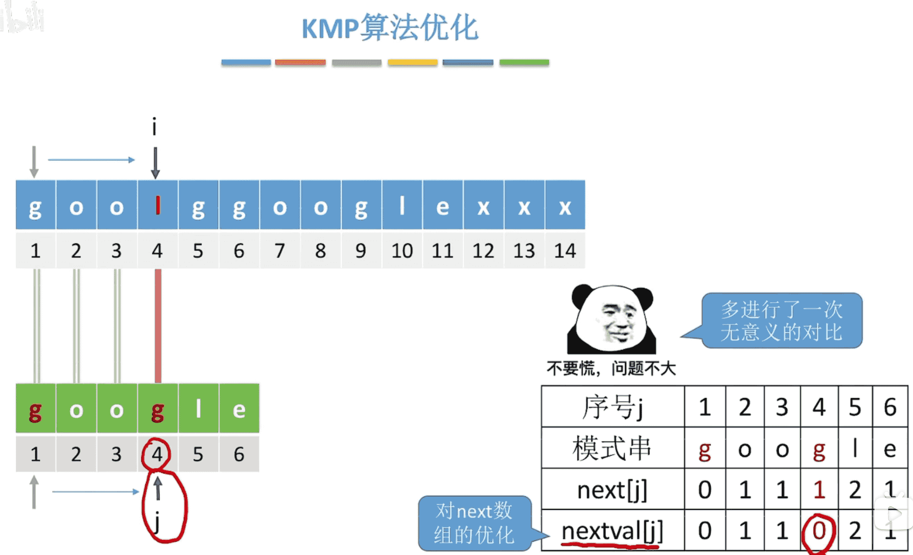


## 数组

1. **一维数组**
	一维数组可看成是一个线性表或一个向量，存储在一块连续的存储单元中，适合于随机查找。一维数组记为A[n]或A=(a0，al，…ai，…，an-1) ，一维数组中ai的存储地址LOC(ai)可由下式求出：
	LOC(ai)=LOC(a0)+i*L (0≤i<n)
2. **二维数组**
	二维数组，又称矩阵(matrix)。每个元素又是一个定长的线性表（一维数组），都要受到两个关系即行关系和列关系的约束，也就是每个元素都同属于两个线性表。例如，设A是一个有m行n列的二维数组，A可以看成由m个行向量组成的向量，也可以看由n个列向量组成的向量。

[数组和广义表详细知识点](https://blog.csdn.net/weixin_42260102/article/details/100106973)

## 广义表

广义表是线性表的推广，也称为列表。

广义表是n(n≥0)个元素的一个序列，表中的元素可以是称为原子的单个元素，也可以是一个子表

若n=0时则称为空表。设ai为广义表的第i个元素，则广义表的一般表示与线性表相同

```
LS=(a1,a2,…,ai,…,an)
```

其中n表示广义表的长度，n≥0。ai可以是单个元素，也可以是广义表

如果ai是单个数据元素，则ai是广义表LS的原子；如果ai是一个广义表，则ai是广义表LS的子表

习惯上，用大写字母表示广义表的名称，用小写字母表示原子

广义表的长度（广度）指：广义表中所包含的数据元素的个数

例如，在广义表 (a,(b,c,d)) 中，它包含一个原子和一个子表，因此该广义表的长度为 2。

再比如，广义表 ((a,b,c)) 中只有一个子表 (a,b,c)，因此它的长度为 1。

广义表的深度，可以通过观察该表中所包含括号的层数间接得到。这里需要注意，数左括号（或右括号）时同一层次的多个括号只计算一次

比如：广义表 ((1,2),(3,(4,5))) 中，此广义表中包含 3 层括号，因此深度为 3

广义表深度 = 匹配最多括号的元素所匹配的括号对数，如上例子中的 4 和 5 都匹配了 3 对括号。

> **题目1**：广义表 (a,(a,b),d,e,==((i,j),k)==) 的长度是（ ），深度是（ ）
> 其长度为5、深度为3、为什么呢？
>
> 长度的求法为最大括号中的逗号数加1
>
> 即为：a 后面的逗号，(a,b) 后面的逗号，d 后面的逗号，e 后面的逗号，==((i,j),k)==前面的逗号，总计有四个，那么广义表的长度是4+1=5;
>
> 深度的求法为上面每个元素的括号匹配数加1的最大值
>
> a为0+1=1;(a,b)为1+1=2;d,e类似a;==((i,j),k)==为2+1=3;故深度为3。
> 原文：https://blog.csdn.net/w_k_l/article/details/78983957


广义表三个重要结论


取表头GetHead(LS)：取出表头为非空广义表的第一个元素，它可以是一个单原子，也可以是一个子表

取表尾GetTail(LS)：取出的表尾为除去表头之外，由其余元素构成的表。即表尾一定是一个广义表


# 五、树和二叉树

## 树和二叉树的定义

### 树的定义

1. 树是一种非线性的数据结构,它是由n个有限结点组成有层次关系的集合.
2. 树具有以下特点，可以根据这些特点来判断一个数据结构是否是树
	- 每个结点具有0个或多个子结点
	- 每个子结点只有一个父结点
	- 没有前驱的结为根结点
	- 除了根结点外，每个子结点又可以由m棵不相关的子树组成

### 树的基本术语

1. 结点的度：结点拥有的子树数量称为结点的度

	

2. 树的度：树内各结点度的最大值，即上图 D 结点的度就是此树的度

3. 叶子：度为 0 的节点称为叶子或终端节点

4. 结点的层次和树的深度


5. 森林：m棵互不相交的树的集合。

### 树的性质

结点数=总度数+1


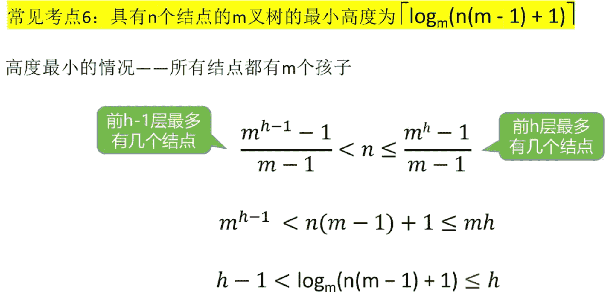

### 二叉树的定义

二叉树与数主要有以下区别：

1. 二叉树每个结点至多只有两颗子树(即二叉树中不能存在度大于 2 的结点)
2. 二叉树的子树有左右之分，其次序不能任意颠倒
3. 即使树中某结点只有一棵子树，也要区分它是左子树还是右子树


## 树和二叉树的抽象数据类型定义

```c
数据对象集：一个有穷的结点集合。
若不为空，则由根结点和其左、右二叉子树组成。
操作集： BT ∈ BinTree, Item ∈ElementType，重要操作有：
Boolean IsEmpty( BinTree BT )： 判别BT是否为空；
void Traversal( BinTree BT )：遍历，按某顺序访问每个结点；
BinTree CreatBinTree( )：创建一个二叉树。
```

常用的遍历方法有：

void PreOrderTraversal( BinTree BT )：先序----根、左子树、右子树；
void InOrderTraversal( BinTree BT )： 中序—左子树、根、右子树；
void PostOrderTraversal( BinTree BT )：后序—左子树、右子树、根
void LevelOrderTraversal( BinTree BT )：层次遍历，从上到下、从左到右

## 二叉树的性质和存储结构

### 二叉树的性质

性质1：在二叉树的第i层上**至多**有2i-1个结点（i>=1）

性质2：深度为k的二叉树**至多**有2k-1个结点（k>=1）


满二叉树：深度为 k 且含有 2k-1个结点


或者 $k=\left \lceil \log_2(n+1)\right \rceil$ 


### 二叉树的存储结构

**顺序存储结构**


二叉树的顺序存储结构缺点很明显：不能反应逻辑关系；对于特殊的二叉树（左斜树、右斜树），浪费存储空间。所以二叉树顺序存储结构一般只用于完全二叉树。

**链式存储结构**


```c
//二叉树的二叉链表存储表示
typedef struct BiTNode {
TElemType data;                     //结点数据域
struct BiTNode *lchild, *rlchild;   //左右孩子指针
} BiTNode, *BiTree;
```

## 遍历二叉树和线索二叉树

### 遍历二叉树

如果限定先左后右，则二叉树遍历方式有三种： 先序（根）：DLR； 中序（根）：LDR ；后序（根）：LRD


**中序遍历的递归算法**：


**中序遍历的非递归算法**：


**层序遍历**


**根据遍历序列确定二叉树**


已知一棵二叉树的后序序列和中序序列，分别是DECBHGFA 和BDCEAFHG 是否可以唯一确定这棵树？

①由后序遍历特征，根结点必在后序序列尾部（即A）；

②由中序遍历特征，根结点必在其中间，而且其左部必全部是左子树子孙（即BDCE），其右部必全部是右子树子孙（即FHG）；

③继而，根据后序中的DECB子树可确定B为A的左孩子，根据HGF子串可确定F为A的右孩子；

**二叉树遍历算法的应用**


### 线索二叉树

[线索二叉树的遍历和构造伪码](https://blog.csdn.net/Ha1f_Awake/article/details/85186310)

以结点p为根的子树中序线索化


**遍历线索二叉树**

带头结点


**不带头结点**


## 树和森林

### 树的存储结构

**双亲表示法**


**孩子表示法**


**孩子兄弟法(常用)**


**树采用二叉链表存储结构即孩子兄弟法**

### 森林与二叉树的转换


### 树和森林的遍历

**树的遍历**

一种是先根（次序）遍历树，即：先访问树的根结点，然后依次先根遍历根的每棵子树；另一种是后根（次序）遍历，即先依次后根遍历每棵子树，然后访问根结点。

**森林的遍历**

先序遍历森林。

- 若森林非空，访问森林的第一棵树的根结点。
- 先序遍历第一棵树中根结点的子树
- 先序遍历除去掉遍历过的树的森林

中序遍历森林：普通的树构成的森林是不存在中序遍历的，这里的中序遍历必然指代的是化成二叉树的森林。**这个相当于对每颗树进行后序遍历**

## 哈弗曼树及其应用

### 哈弗曼树的基本概念

哈弗曼树又被称为最优树

路径：从一个结点到另一个结点之间的分支序列

路径长度：从一个结点到另一个结点所经过的分支数目

结点的权：根据应用的需要可以给树的结点赋权值

结点的带权路径长度：从根到该结点的路径长度与该结点权的乘积

**树的带权路径长度**：树中所有叶子结点的带权路径之和，记做 $WPL=\underset{k=1}{\overset{n}{\sum}}w_kl_k$ 

哈夫曼树：由n个带权叶子结点构成的所有二叉树中带权路径长度最短的二叉树

**哈弗曼树不存在度为 1 的结点**。**n个叶子结点的哈弗曼树有 2n-1 个结点**


### 哈夫曼树的构造算法


### 哈夫曼编码

**前缀码**：如果在一个编码系统中，任一个编码都不是其他任何编码的前缀，则称该编码系统中的编码是前缀码。例如，一组编码01,001,010,100,110就不是前缀码，因为01是010的前缀，若去掉01或010就是前缀码。

**哈夫曼编码**：对一棵具有n个叶子的哈夫曼树，若对树中的每个左分支赋予0，右分支赋予1，则从根到每个叶子的通路上，各分支的赋值分别构成一个二进制串，该二进制串就称为哈夫曼编码。

哈夫曼编码满足下面的两个性质：

- 性质1：哈夫曼编码是前缀编码
- 性质2：哈夫曼编码是最优前缀编码

# 六、图

## 图的定义和基本术语

### 图的定义

图G由顶点集V和边集E组成，记为G=(V,E)，其中V(G)表示图G中顶点的有限非空集；E(G)表示图G中顶点之间的关系(边)的集合。

**注意：线性表可以是空表，树可以是空树，图不可以是空图，图可以没有边，但是至少要有一个顶点**。

**有向图**

若E是有向边（简称弧）的有限集合时，则G为有向图。弧是顶点的有序对，记为<v,w>，其中 v，w 是顶点。当v 是弧尾，w 是弧头时，称为从顶点v到顶点w的弧。


如上图所示G可表示为：

```
G=(V,E)
V={1,2,3}
E={<1,2>, <2,1>, <2,3>}
```

**无向图**

若E是无向边（简称边）的有限集合时，则G为无向图。边是顶点的无序对，记为 (v,w) 或(w,v) ，且有 (v,w) =(w,v) 。其中 v，w 是顶点。

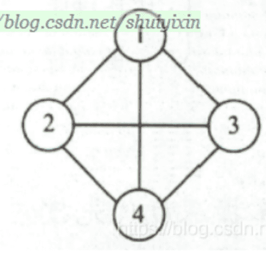

```
G=(V, E)
V={1,2,3,4}
E={(1,2), (1,3), (1,4), (2,3), (2,4), (3,4)}
```

### 图的基本术语

**子图：**

若有两个图G=(V,E),G1=(V1,E2)，若V1是V的子集且E2是E的子集，称G1是G的子图。

**完全图：**

1. 无向图中任意两点之间都存在边，称为无向完全图

2. 有向图中任意两点之间都存在方向向反的两条弧，称为有向完全图

**稀疏图和稠密图：**

边小于 nlogn 的图称为稀疏图，反之称为稠密图

**权和网：**	

1. 在实际应用中，每条边可以标上具有某种含义的数值，该数值称为该边上的权，这些权可以表示从一个顶点到另一个顶点的距离或耗费
2. 带权的图称为网

**邻接点：**

对于无向图 G，如果图的边 (v, v')EE, 则称顶点 v 和 v'互为邻接点

**顶点的度、入度和出度：**

顶点的度为以该顶点为一个端点的边的数目

**对于无向图，顶点的边数为度，度数之和是顶点边数的两倍**

对于有向图，入度是**以顶点为终点（即箭头所指方向），出度是以顶点为起点 （即箭尾巴所指方向）** 。

有向图的全部顶点入度之和等于出度之和且等于边数。顶点的度等于入度与出度之和

**注意：入度与出度是针对有向图来说的**

**路径和路径长度：**

路径长度是一条路径上经过的边或弧的数目

**回路或环：**

第一个顶点和最后一个顶点相同的路径称为回路或环

**简单路径、简单回路或简单环：**

顶点不重复出现的路径称为简单路径。

除第一个顶点和最后一个顶点外，其余顶点不重复出现的回路称为简单回路或简单环

**连通、连通图、连通分量：**

**连通图一定是无向图**

在无向图中，两顶点有路径存在，就称为连通的。

若图中任意两顶点都连通，同此图为连通图。无向图中的极大连通子图称为连通分量。

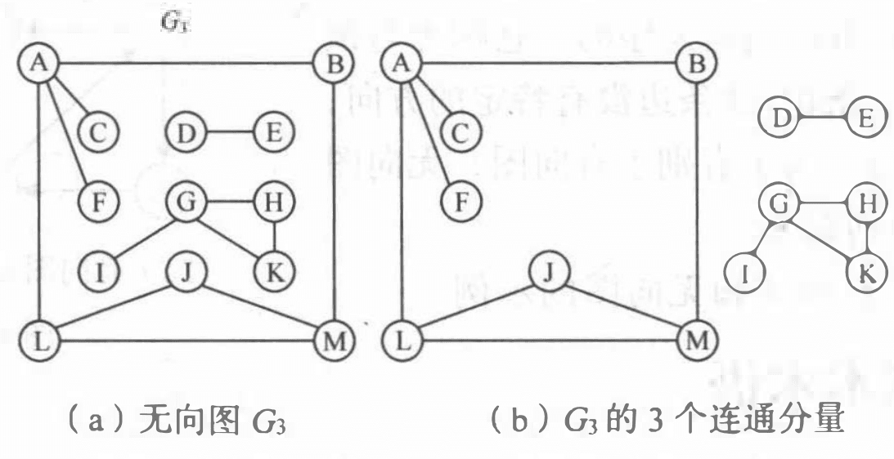

**强连通图、强连通分量：**

在有向图中，两顶点两个方向都有路径，两顶点称为强连通。若任一顶点都是强连通的，称为强连通图

有向图中极大强连通子图为有向图的强连通分量


**连通图的生成树(无向树):**

**连通图的生成树**是包含图中全部顶点的一个极小连通子图，若图中有n个顶点，则生成树有n-1条边，仅有足以构成一颗树的 n-1 条边

所以对于生成树而言，若砍去一条边，就会变成非连通图，若加上一条边，则构成一个环，因为这条边使得他依附的那两个顶点之间有了第二条路径

**有向树和生成森林:**

有一个顶点的入度为0，其余顶点的入度均为1的有向图称作有向树。

一个有向图的生成森林是由若干棵有向树组成，含有图中全部顶点，但只有足以构成若干棵不相交的有向树的弧


## 图的存储结构

### 邻接矩阵法(数组表示法)

[图算法基本代码](https://blog.csdn.net/hh66__66hh/article/details/83070129)


邻接矩阵表示法的优缺点：

1. 优点：
	- 便于判断两个顶点之间是否有边， 即根据A[i] [j] = 0或1来判断
	- 便于计算各个顶点的度。对于无向图，邻接矩阵第 i 行元素之和就是顶点 i 的度；对于有向图，第 i 行元素之和就是顶点 i 的出度，第 i 列元素之和就是顶点 i 的入度

1. 缺点：
	- 不便于增加和删除顶点
	- 不便于统计边的数目，需要扫描邻接矩阵所有元素才能统计完毕，时间复杂度为 O(n^2)
	- 空间复杂度高

### 邻接表


有向图的逆邻接表又称入度表


邻接表表示法的优缺点：

1. 优点
	- 便于增加和删除结点
	- 便于统计边的数目
	- 空间效率高

2. 缺点

	- 不便于判断顶点之间是否有边

	- 不便于计算有向图各个顶点的度

### 十字链表


### 邻接多重表


## 图的遍历

### 深度优先搜索（DFS）


**对于非连通图**


当用邻接矩阵表示图时，查找每个顶点的邻接点的时间复杂度为 O(n^2), 其中 n为图中顶点数。而当以邻接表做图的存储结构时，查找邻接点的时间复杂度为O(e), 其中e为图中边数。由此， 当以邻接表做存储结构时， 深度优先搜索遍历图的时间复杂度为 O(n + e)

### 广度优先搜索(BFS)

广度优先遍历通常借助队列来实现算法


当用邻接矩阵存储时，时间复杂度为O(n^2); 用邻接表存储时，时间复杂度为O(n+ e)。两种遍历方法的不同之处仅仅在于对顶点访问的顺序不同。


## 图的应用

### 最小生成树

>首先关于树的生成树：
>
>

#### 普里姆算法（Prim）

算法的时间复杂度为O(n2)，与图中边数无关，该算法适合于稠密图

首先随意找一个顶点，一般都是v1，然后找到与v1相连的权值最小的边（若有多条，则随机选取一条），然后找与这两个点相连的有最小权值的边，然后与找这三个点相连权值最小的边，一直重复，直到有n-1条边，并且连接完所有的顶点


#### 克鲁斯卡尔算法(Kruskal)

基本思想：按照权值从小到大的顺序选择n-1条边，并保证这n-1条边不构成回路。

具体做法：首先构造一个只含n个顶点的森林，然后依权值从小到大从连通网中选择边加入到森林中，并使森林中不产生回路，直至森林变成一棵树为止。

时间复杂度为：O（eloge） 边数e越大，所耗费时间越长，则适合稀疏图


### 最短路径

#### 迪杰斯拉(Dijkstra)算法


#### 弗洛伊德算法

动态规划思想


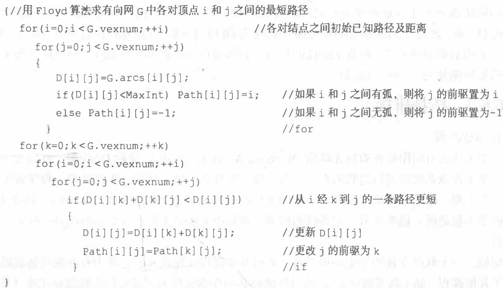

### 拓扑排序

一个无环的有向图称作为**有向无环图**，简称**DAG图**。


用顶点表示活动，用弧表示活动间的优先关系的有向图称为顶点表示活动的网，简称**AOV网**


### 拓扑排序的实现


### 关键路径

**AOE网**：与AOV-网相对应的是 AOE-网 (Activity On Edge) , 即以边表示活动的网

AOE网是一个带权的有向无环图


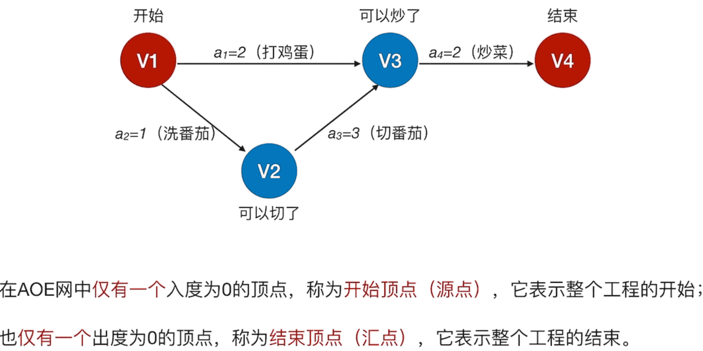

估算整项工程完成的最短时间， 就是要找一条从源点到汇点的带权路径长度最长的路径，称为**关键路径** 

关键路径上的活动叫做**关键活动**


#### 关键路径求解的过程


# 七、查找

## 查找的基本概念

**查找表：**用于查找的数据元素集合。查找表由同一类型的数据元素（或记录）构成

**关键字：** 是数据元素中的某个数据项。唯一能标识数据元素（或记录）的关键字，即每个元素的关键字值互不相同，这种关键字称为主关键字；若查找表中某些元素的关键字值相同，称这种关键字为次关键字

**静态查找表：**只做**查找表是否存在某元素，从查找表中检索某特定元素的属性**操作的称为静态查找表

**动态查找表：在查找表中插入一个元素，在查找表中删除一个元素**操作的称为动态查找表

## 线性表的查找

### 顺序查找


### 折半查找

**当静态查找表的关键字有序时，可以用折半查找来实现**

```c
int Search_Bin(SSTable ST, KeyType key) {
    //在有序表ST中折半查找其关键字等于key的数据元素。若找到，则函数值为该元素在表中的位置， 否则为0
    low = 1;
    high = ST.length;           //置查找区间初值
    while (low <= high) {
        mid = (low + high) / 2;
        if (key == ST.R[mid].key) {
            return mid;
        }
        else if (key < ST.R[mid].key) {
            high = mid - 1;
        } else low = mid + 1;
        return 0;
    }
}
```

### 分块查找

分块查找又称为**索引顺序查找**，这是一种性能介于顺序查找和折半查找之间的一种查找方法


- **优点**：插入和删除比较容易，无需进行大量的移动。
- **缺点**：要增加一个索引表的存储空间并对初始索引表进行排序运算。
- **适用情况**：如果线性表既要快速查找又经常动态变化，则可采用分块查找

## 树表的查找

顺序查找、二分(折半)查找和索引查找都是静态查找表，其中二分查找的效率最高。

静态查找表的缺点是当表的插入或删除操作频繁时，为维护表的有序性，需要移动表中很多记录。

这种由移动记录引起的额外时间开销，就会抵消二分查找的优点（二分查找和分块查找只适用于静态查找表）。

若要对动态查找表进行高效率的查找，可以使用树表。

以二叉树或树作为表的组织形式，称为树表。
### 二叉排序树

1. **二叉排序树的定义**

二叉排序树又称**二叉查找树**，它是一种排序和查找都很有用的特殊二叉树。

二叉排序树右称二叉查找树。或者为空树，或者是具有以下性质：

（1）若它的左子树不为空，则左子树所有节点的值小于根结点，

（2）若它的右子树不为空，则根结点的值小于所有右子树结点的值

（3）它的左右子树叶分别为二叉排序树

**总结起来就是根据结点的值有：左子树<根结点<右子树**

**中序遍历**一颗二叉排序树可以得到一个结点值**递增的有序序列**


2. **二叉排序树的查找**


**非递归**


其平均查找长度的数量级与log2N 相同

**注意：二叉排序树中没有值相同的节点**

3. **二叉排序树的插入**

二叉排序数插入过程的基本过程是查找，所以时间复杂度同查找一样，是O(log2n)

 a.插入过程比较简单，首先判断当前要插入的值是否已经存在二叉排序树中，如果已经存在，则直接返回；如果不存在，则转b;

 b.当前要插入的值不存在，则应找到适当的位置，将其插入。注意插入的新节点一定是**叶子节点**；


4. **二叉排序树的创建**

二叉树创建就是从根节点按关键字序列插入的过程


5. **二叉排序树的删除**

删除二叉排序树中任意一个结点，需要分成以下三种情况讨论：

（1）删除的是叶子结点

这种情况最简单，由于删除叶子结点不会破坏整棵树的结构，只需要修改其双亲结点的指针即可。

（2）删除的结点只有左子树或只有右子树。

这种情况只需要将其左子树或右子树往上推，替代要删除结点的位置，显然，作此修改也不会破坏二叉排序树的结构。


（3）删除的结点左右子树都不为空

这种情况稍微复杂一点，为了不保持二叉排序树的结构，有两种思路，一种就是从要删除结点的左子树中选取最大的结点进行替代之（前驱），另一种就是从要删除的结点的右子树中选取最小的结点替代之(后继)


查找效率分析


### 平衡二叉树（AVL树）

它或者是颗空树，或者是具有下列性质的二叉树：

- 它的左子树和右子树都是平衡二叉树，且左子树和右子树的深度之差的绝对值不超过1。
- 若将二叉树节点的**平衡因子**BF定义为该节点的**左子树的深度减去它的右子树的深度**，则平衡二叉树上所有节点的平衡因子只可能为-1,0,1.
- 只要二叉树上有一个节点的**平衡因子的绝对值大于1**，那么这颗平衡二叉树就失去了平衡。


因为AVL树上任何结点的左右孩子子树的深度之差都不超过1，则可以证明它的深度和 log2n是同数量级的(其中n为结点个数)。由此，其查找的时间复杂度为**O(log2n)**

**最小不平衡子树**

是指离插入结点最近且以**平衡因子的绝对值大于1的结点作为根的子树**。


### B树

[漫画：什么是B-树](https://www.sohu.com/a/154640931_478315)

[B-树的详解](https://blog.csdn.net/qq_35644234/article/details/66969238)

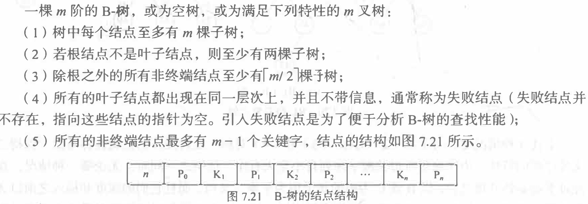


其中条件都是为了保证B树的查找效率


#### B树的查找


#### B树的插入


#### B树的删除


### B+树


#### B+树的查找、插入和删除


## 散列表的查找

### 散列表的基本概念

散列表也叫==哈希表==

1. 散列函数和散列地址:在记录的存储位置p和其关键字key之间建立一个确定的对应关系H,使 p= H(key) ,称这个对应关系H为散列函数，p为散列地址。

2. 散列表：采用散列技术将记录存放在一块连续有限的存储空间中，这块连续存储空间称为散列表或哈希表。通常散列表的存储空间是一个一维数组，散列地址是数组的下标。

3. 冲突和同义词:对不同的关键字可能得到同一散列地址，即 key1≠key2, 而H(key1) =H( key2)，这种现象称为冲突。具有相同函数值的关键字对该散列函数来说称作同义词，key1 与 key2 互称为同义词。

### 散列函数的构造方法

**数字分析法**

数字分析法通过适合处理关键字位数比较大的情况，如果事先知道关键字的分布且关键字的若干位分布比较均匀，就可以考虑用这个方法。

**平方取中法**

这个方法计算很简单，假设关键字是1234，那么它的平方就是1522756，再抽取中间的3位就是227，用做散列地址。平方取中法比较适合不知道关键字的分布，而位数又不是很大的情况。

**折叠法**

折叠法是将关键字从左到右分割成位数相等的几部分（注意最后一部分位数不够时可以短些），然后将这几部分叠加求和，并按散列表表长，取后几位（舍去进位）作为散列地址。

比如关键字是9876543210，散列表表长为三位，将它分为四组，987|654|321|0，然后将它们叠加求和987 + 654 + 321 + 0 = 1962，去掉进位得到散列地址962。

折叠法事先不需要知道关键字的分布，适合关键字位数较多的情况。

**除留余数法**

此方法为最常用的构造散列函数方法。对于散列表长为m的散列函数公式为： H(key) = key%p

%是取模（求余数）的意思。事实上，这方法不仅可以对关键字直接取模 ，也可以再折叠、平方取中后再取模。

很显然，本方法的关键在于选择合适的p，p如果选不好，就可能会容易产生冲突。

根据前辈们的经验，若散列表的表长为m，通常p为小于表长的最大质数或不包含小于20质因子的合数。

### 处理冲突的方法

处理冲突的实际含义是：为产生冲突的地址寻找下一个哈希地址（散列地址）

#### 开放地址法

所谓的开放地址法就是一旦发生了冲突，就去寻找下一个空的散列地址，只要散列表足够大，空的散列地址总能找到，并将记录存入。

通常把寻找下一个空位的过程称为**探测**

它的公式为：Hi = (H(key)+di)%m	i =1,2,3…,k(k≤m-1)

其中di 为增量序列，根据 di 取值的不同，可以分为以下3中探测方法

1. 线性探测法

	di = 1,2,3,…,m-1


2. 二次探测法

	di = 1^2 ,-1^2 ,2^2 ,-2^2 ,3^2 ,……，+k^2 ,-k^2 （k≤m/2）

3. 

在冲突时，对于位移量di采用随机函数计算得到，称之为随机探测法。

既然是随机，那么查找的时候不也随机生成di 吗？如何取得相同的地址呢？这里的随机其实是伪随机数。伪随机数就是说，如果设置随机种子相同，则不断调用随机函数可以生成不会重复的数列，在查找时，用同样的随机种子，它每次得到的数列是想通的，相同的di 当然可以得到相同的散列地址。


#### 链地址法


此时，已经不存在什么冲突换地址的问题，无论有多少个冲突，都只是在当前位置给单链表增加结点的问题。

链地址法对于可能会造成很多冲突的散列函数来说，提供了绝不会出现找不到地址的保证。当然，这也就带来了查找时需要遍历单链表的性能损耗


### 散列表的查找


# 八、排序

[Data Structure Visualization](https://www.cs.usfca.edu/~galles/visualization/Algorithms.html)

## 基本概念和排序方法概述

### 排序的基本概念

1. 排序 ：就是一系列数据，按照某个关键字（例如：销量，价格），进行递增或者递减的顺序排列起来

2. 排序的稳定性 ：能保证两个关键字相等的数，经过排序之后，其在序列的前后位置顺序不变。（A1=A2，排序前A1在A2前面，排序后A1还在A2前面），则称这种排序是稳定的。反之，若排序后前后位置顺序变化，则称这种排序是不稳定的

3. 内部排序和外部排序 ：待排序记录全部存放在计算机内存中进行排序的过程称为内部排序；在排序过程中需对外存进行访问的排序过程

4. 内部排序的过程是一个逐步扩大记录的有序序列长度的过程


### 内部排序方法的分类


### 待排序记录的存储方式

1. 顺序表：实现排序需要移动记录
2. 链表：实现排序不需要移动记录，仅需修改指针即可。这种排序方式称为链表排序
3. 地址排序：在排序过程中不移动记录本身，而移动地址向量这些记录的“地址”，在排序结束之后再按照地址向量中的值调整记录的存储位置

## 插入排序


把待排序的数据插入到已经排好序的数据中，直到所有的数据插入完成，即就是直接插入排序。

```c
void InsertSort(SqList &L) {
    //从第二个数开始选择循环，第一个数默认当做已排序状态
    for (int i = 2; i <= L.length; ++i) {
        //当 当前数小于前一个数的时候，进入if判断
        if (L.r[i].key < L.r[i - 1].key) {
            //将此数暂存到监视哨中
            L.r[0] = L.r[i];
            //前一个数后移，空出前一个数的位置，看上面的gif
            L.r[i] = L.r[i - 1];
            //第二层循环，用于比较此数与已排序状态中各个数的大小
            //上面判断过此数小于前一个数，所以直接 j=i-2
            //若r[j]是最小的数，则当j=0的时候，会退出循环
            for (j = i - 2; L.r[0].key < L.r[j].key; --j) {
                //当此数比L.r[j]小时，L.r[j]后移，空出位置以便此数插入
                L.r[j + 1] = L.r[j];
            }
            //第二层循环结束，将监视哨中的原值插入到正确的位置
            L.r[j + 1] = L.r[0];
        }
    }
}
```

时间复杂度：平均O(n^2)，最好O(n)， 最坏O(n^2)
空间复杂度：O(1)，因为只需要一个记录的辅助空间 r[0]

特点：

1. 稳定性：稳定
2. 也适用于链式存储结构，只是在单链表上无需移动记录，只需修改相应的指针
3. 更适用与初始化基本有序的情况

### 折半插入排序

折半查找和插入排序的结合，因为前n-1一个元素以及排序完成，当第n个元素插入时可以折半查找寻找位置


时间复杂度：O(n^2)

空间复杂度：仍是只需要一个记录的辅助空间r[0]，所以时间复杂度为O(1)

特点：

1. 稳定性：稳定
2. 因为要进行折半查找，所以只能用于顺序结构，不能用于链式结构
3. 适合初始记录无序、n较大的时候

### 希尔排序


**设定分量d进行分组，对每组进行插入排序，每次分量d进行缩小，直到为1**


空间复杂度：也是只需要一个辅助空间 r[0] ，所以时间复杂度为O(1)

特点：

1. 稳定性：因为记录跳跃式地移动，所以不稳定
2. 只适用于顺序结构，不能用于链式结构
3. 适用于初始记录无序、n较大的情况

## 交换排序

### 冒泡排序


时间复杂度为O(n2)，但若是一开始就是有序的，则时间复杂度为O(n)

特点：

1. 稳定性：稳定
2. 可以用于链式存储结构
3. 当初始记录无序，n较大时，此算法不宜采用

### 快速排序

选择一个元素将其交换到他应该到的位置


时间复杂度：O(nlog2n)

空间复杂度：最好情况下的空间复杂度为：O(log2n)，最坏情况下为O(n)

特点：

记录非顺次的移动导致排序方法是不稳定的
排序过程中需要定位表的下界和上界，所以适合用于顺序结构，很难用于链式结构
当n较大时，在平均情况下快速排序是所有内部排序方法中速度最快的一种，所以其适合初始记录无序、n较大时的情况

## 选择排序

### 简单选择排序

在要排序的一组数中，选出最小（或者最大）的一个数与第1个位置的数交换；然后在剩下的数中再找最小（或者最大）的与第2个位置的数交换，以此类推，直到 第n-1个元素（倒数第二个数）和第n个元素（最后一个数）比较为止。


时间复杂度：O(n^2)

空间复杂度：同冒泡排序一样，只有在两个记录交换时需要一个辅助空间，所以空间复杂度为O(1)

特点：

1. 稳定性：就选择排序方法来讲是稳定的，但教程中实现的方法是不稳定的
2. 可用于链式存储结构
3. 移动记录次数较少，当每一记录占用的空间较多时，此方法比直接插入排序快

### 堆排序

**堆是具有以下性质的完全二叉树：每个结点的值都大于或等于其左右孩子结点的值，称为大顶堆；或者每个结点的值都小于或等于其左右孩子结点的值，称为小顶堆。如下图：**


#### 堆排序算法

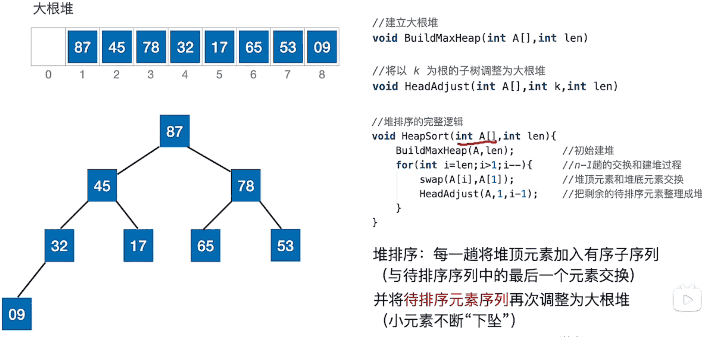

#### 堆排序插入删除


## 归并排序

归并排序是用分治思想，分治模式在每一层递归上有三个步骤：

- **分解（Divide）**：将n个元素分成个含n/2个元素的子序列
- **解决（Conquer）**：用合并排序法对两个子序列递归的排序
- **合并（Combine）**：合并两个已排序的子序列已得到排序结果


## 基数排序


从最低位（个位）开始进行，按关键字的不同收集，然后按第二低位（十位）开始进行，按关键字的不同收集，若有些数没有更低位，则按0收集

特点：

1. 稳定性：稳定排序
2. 可用于链式结构，也可用于顺序结构
3. 基数排序需要知道各级关键字的取值范围

## 外部排序

### 多路平衡归并

[外部排序](https://www.bilibili.com/video/BV1b7411N798?p=87)


### 败者树

[败者树](https://www.bilibili.com/video/BV1b7411N798?p=88)


### 置换-选择排序

[置换-选择排序](https://www.bilibili.com/video/BV1b7411N798?p=89)


### 最佳归并树

就是哈夫曼树

[最佳归并树](https://www.bilibili.com/video/BV1b7411N798?p=90)


